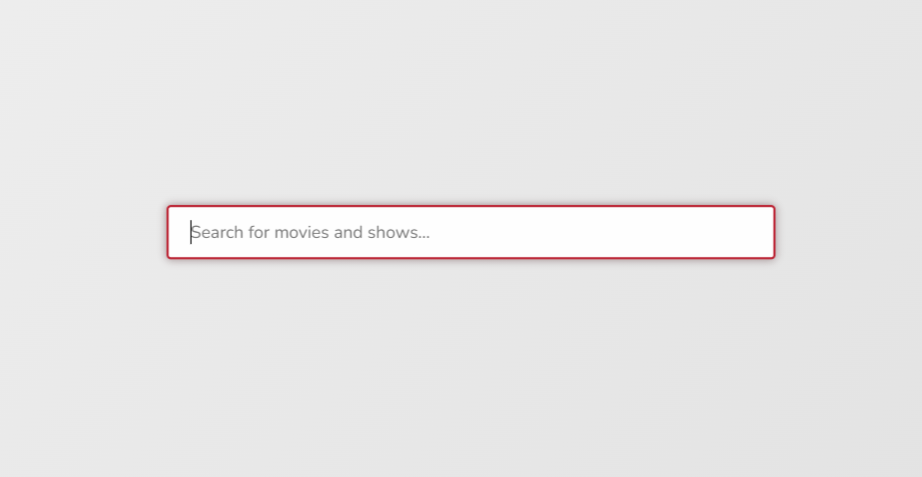

# Varicode - PagerDuty || Frontend Test

## How to run the project

Clone the repo. Then, in the project directory, you can run:

### `npm start`

Runs the app in the development mode.
Open [http://localhost:3000](http://localhost:3000) to view it in the browser.

In order to test its functionality, the component is connected to [Watchmode API](https://api.watchmode.com/docs/#api-reference).
So, when you type into the input, you should see a list of movies and tv shows as recommendations for your search.

